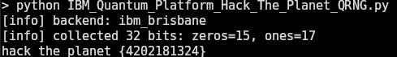

# Simple Quantum Random Number Generator (QRNG) with Qiskit 🌌🔒

This is a simple POC **Quantum Random Number Generator (QRNG)** built with python lib [Qiskit](https://qiskit.org/) and the [IBM Quantum Cloud Platform](http://quantum.cloud.ibm.com).  

It uses a real **Quantum Processing Unit (QPU)** (on IBM’s free tier) to generate *true randomness* ; not the pseudo-randomness you get from classical computers.  

🔥 Source code included. Hack the planet!!!  

---

## ✨ Features
- Access IBM Quantum hardware for genuine quantum randomness.
- Default: generates 32 random bits, but configurable via env vars.
- Reports bit distribution (zeros/ones).
- Lightweight, single-file Python program.
- Runs on IBM’s free plan with minimal setup.

---

## 📸 Screenshots

### Running the QRNG


Example output:
```bash
$ python Simple_QRNG.py
[info] backend: ibm_brisbane
[info] collected 32 bits: zeros=15, ones=17
hack the planet {4202181324}
````

---

## ⚙️ Setup & Installation

1. Clone the repo:

   ```bash
   git clone https://github.com/WildWestCyberSecurity/Simple-Quantum-Random-Number-Generator-Qiskit-Python.git
   cd Quantum-Random-Number-Generator-qiskit
   ```

2. Install dependencies:

   ```bash
   pip install qiskit qiskit_ibm_runtime
   ```

3. Export your IBM Quantum credentials(find these in ibm portal):

   ```bash
   export IBM_QUANTUM_TOKEN="your_api_token_here"
   export IBM_QUANTUM_INSTANCE="your_instance_id_here"  
   export IBM_BACKEND="ibm_brisbane"                       
   ```

---

## ▶️ Usage

Run it:

```bash
python Simple_QRNG.py
```

Environment variables:

* `IBM_QUANTUM_TOKEN` → Your IBM Quantum API token (**required** easy to find these in ibm portal!).
* `IBM_QUANTUM_INSTANCE` → Project/instance (**required** ^).
* `IBM_BACKEND` → Preferred backend (**required** ^^).
* `QRNG_BITS` → Number of bits to generate (default: 32).
* `QRNG_VERBOSE` → Verbose logging (default: 1).

---

## 📜 License

MIT License — total freedom to use, modify, and share. Attribution appreciated.

---

## 💡 Inspiration

*"Hack the Planet!"* 🌍
Built for fun, cryptography experiments, and as a our first step into the wild world of **Quantum Computing**. More to come soon!


